# 基于mvc的高校办公室行政事务管理系统

#### 介绍

本在线家具商城系统基于 Spring Boot 框架开发，旨在为家具销售和管理提供一个高效、便捷的数字化平台。该系统分为管理员角色和教师角色，以满足不同用户的需求和操作权限。

#### 技术栈

后端技术栈：Springboot+Mysql+Maven

前端技术栈：Vue+Html+Css+Javascript+ElementUI

开发工具：Idea+Vscode+Navicate

#### 系统功能介绍

（一）管理员角色  
个人中心：管理员可在此查看和修改个人信息，接收重要通知和系统消息。  
管理员管理：对其他管理员账号进行添加、删除、权限设置等操作，确保管理团队的合理配置和职责分工。  
人事管理  
教师管理：全面管理教师的个人信息、工作岗位、绩效评估等，实现对教师队伍的有效组织和管理。  
请假申请管理：审批教师的请假申请，根据实际情况决定是否批准，并记录请假信息。  
离职申请管理：处理教师的离职申请，进行相关手续的办理和信息存档。  
物资管理  
办公室管理：对办公室的分配、使用情况进行监控和管理，确保办公资源的合理利用。  
办公室申请管理：审核教师的办公室申请，根据办公室的可用性和申请的合理性进行审批。  
办公物资管理：对各类办公物资进行登记、库存盘点和损耗统计。  
办公物资申请管理：审批教师的办公物资申请，保障物资的合理分配和及时供应。  
会议管理  
会议室管理：对会议室的数量、位置、容纳人数等信息进行登记和管理。  
会议室申请管理：审批教师的会议室申请，协调会议安排，避免冲突。  
印章管理  
印章申请管理：处理教师的印章使用申请，确保印章的使用符合规定和流程。  
印章添加申请管理：审核新印章的添加申请，保障印章管理的规范性和安全性。  
基础数据管理  
办公物资类型管理：对办公物资的类型进行分类和定义，方便物资的管理和统计。  
会议室类型管理：区分不同类型的会议室，如小型会议室、中型会议室、大型会议室等，以满足不同会议需求。  

（二）教师角色  
个人中心：教师可查看和修改个人资料，了解与自己相关的通知和信息。  
人事管理  
请假申请管理：提交请假申请，说明请假原因和时长。  
离职申请管理：发起离职申请，并按照规定流程办理离职手续。  
物资管理  
办公室管理：查看自己所在办公室的信息和相关规定。  
办公室申请管理：根据工作需要提交办公室申请。  
办公物资管理：了解自己所领用的办公物资情况。  
办公物资申请管理：申请所需的办公物资。  
会议管理  
会议室管理：查看会议室的基本信息和预订情况。  
会议室申请管理：根据会议需求申请会议室，并查看申请结果。  
印章管理  
印章申请管理：根据工作需要申请使用印章。  
印章添加申请管理：在有必要时申请添加新的印章。  

#### 系统作用

提高管理效率  
为管理员提供了集中、统一的管理平台，能够快速处理各类事务，减少繁琐的人工操作和信息沟通成本。  
规范工作流程  
明确了教师和管理员在人事、物资、会议、印章等方面的工作流程和审批环节，确保各项工作的规范化和标准化。  
优化资源配置   
通过对办公室、会议室、办公物资等资源的有效管理，实现资源的合理分配和最大化利用，避免浪费和闲置。  
增强信息透明度  
教师和管理员能够清晰了解各项事务的申请、审批和处理进度，提高了工作的透明度和公正性。  
提升服务质量  
及时响应教师的需求，提高教师的工作满意度和工作效率，为教学和科研工作提供更好的支持。  

#### 系统功能截图

代码结构

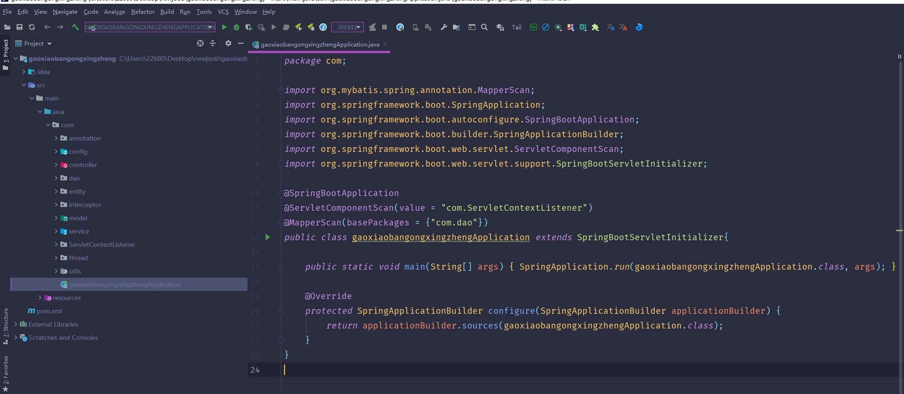

数据库表

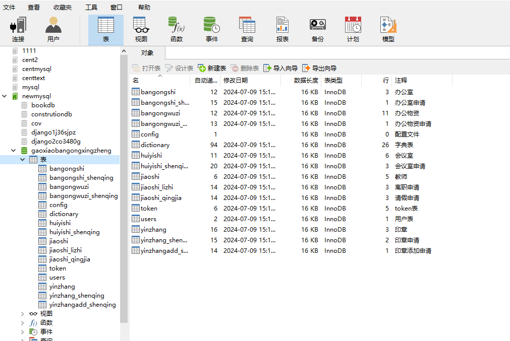

登录

教师端个人信息

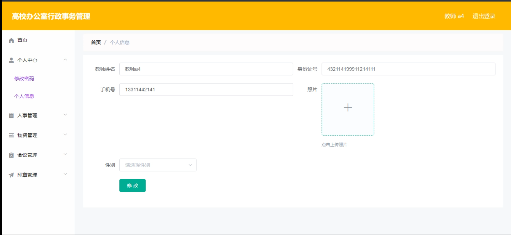

人事管理中请假申请管理

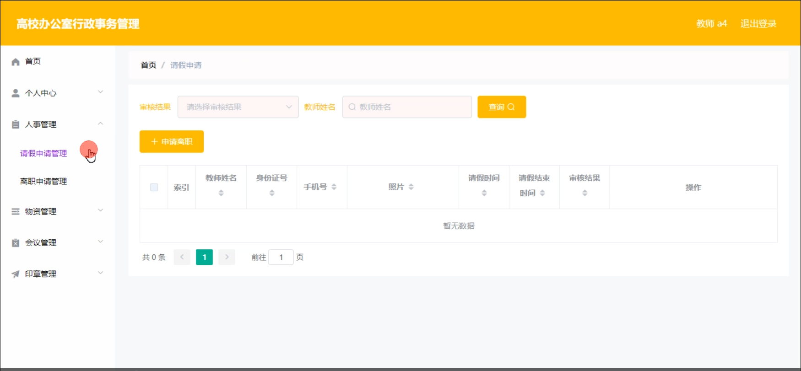

离职申请管理

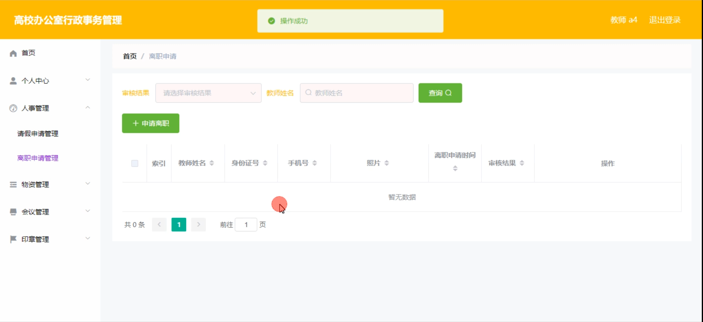

办公室管理

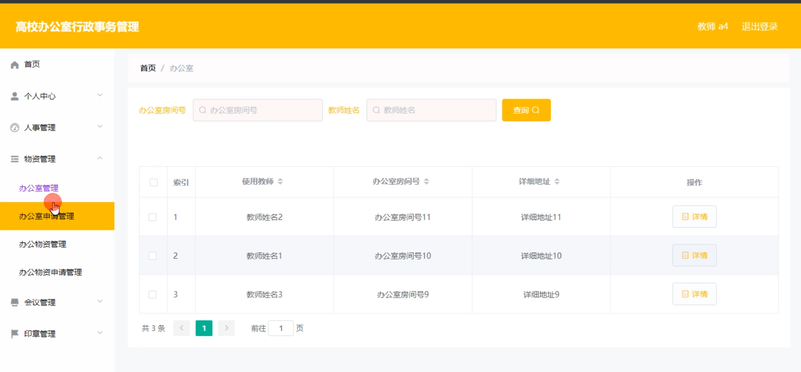

印章管理

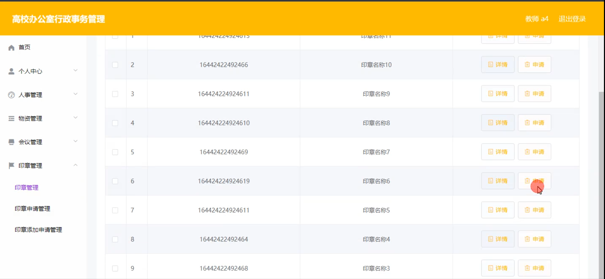

管理员端教师管理

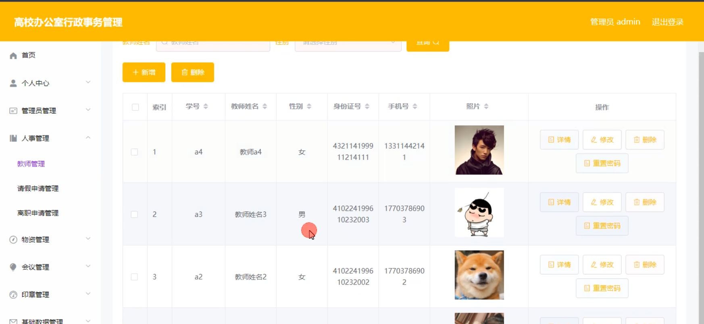

会议室申请管理

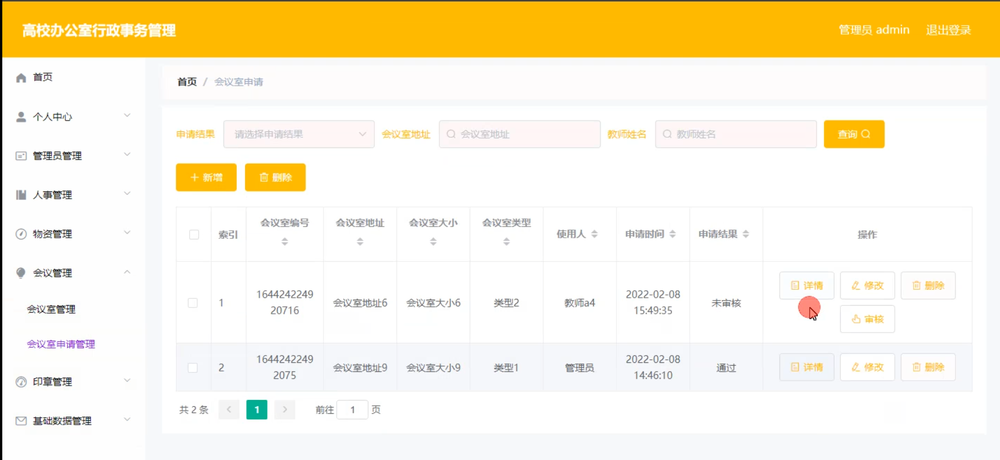

基础数据管理

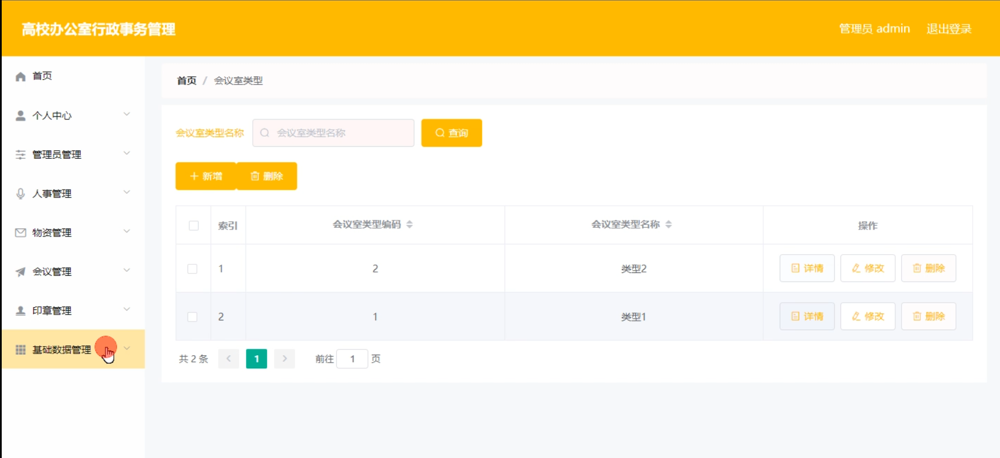

印章申请管理

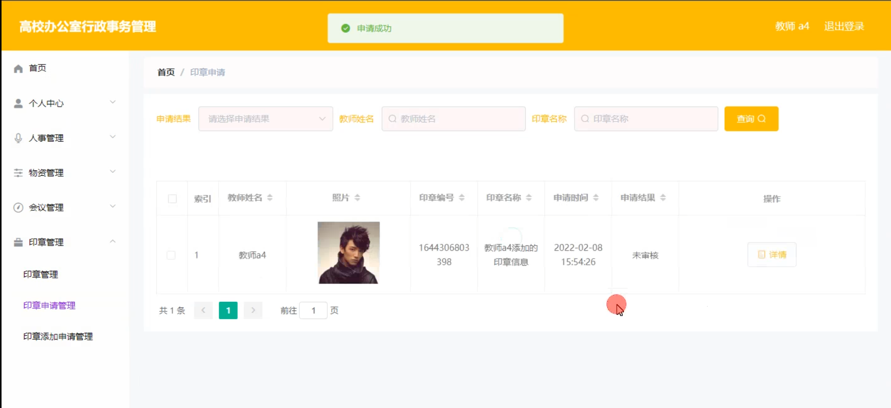

#### 总结

基于 Spring Boot 的在线家具商城系统通过合理的角色划分和功能模块设计，实现了对家具商城运营过程中的人事、物资、会议和印章等方面的全面管理。不仅提高了工作效率和管理水平，还为教师提供了便捷的服务，促进了家具商城的规范化、信息化发展。未来，随着业务的拓展和需求的变化，系统将不断优化和完善，以适应新的挑战和机遇。

#### 使用说明

创建数据库，执行数据库脚本 修改jdbc数据库连接参数 下载安装maven依赖jar 启动idea中的springboot项目

后台登录页面
http://localhost:8080/gaoxiaobangongxingzheng/admin/dist/index.html

管理员			账户:admin 	密码：admin
教师				账户:a1 		密码：123456
教师				账户:a2 		密码：123456
教师				账户:a3 		密码：123456